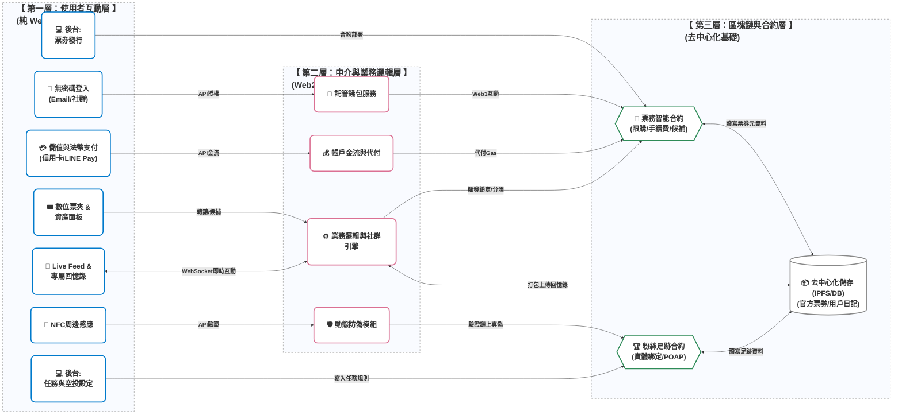

```mermaid
 %%{init: {"flowchart": {"nodeSpacing": 40, "rankSpacing": 150, "padding": 40}}}%%
flowchart LR
    %% 全局預設字體與線條設定
    classDef default font-size:22px,font-weight:bold,rx:12,ry:12
    linkStyle default font-size:18px,font-weight:bold

    %% 恢復最初的配色 (純白底色 + 安全色碼邊框)
    classDef uiNode fill:#ffffff,stroke:#007acc,stroke-width:3px,color:#333333
    classDef midNode fill:#ffffff,stroke:#db7093,stroke-width:3px,color:#333333
    classDef blockNode fill:#ffffff,stroke:#2e8b57,stroke-width:3px,color:#333333
    classDef storageNode fill:#ffffff,stroke:#888888,stroke-width:3px,color:#333333
    
    %% 外層標題樣式 (增加行距空間)
    classDef layerStyle fill:#f9fbff,stroke:#bbbbbb,stroke-width:2px,stroke-dasharray: 5 5,color:#333333,font-size:26px,font-weight:bold

    subgraph Layer1 ["【 第一層：使用者互動層 】<br>(純 Web2 UX)"]
        direction TB
        %% 依據上到下的連線邏輯排列，避免線條打結
        A1("💻 後台:\n票券發行"):::uiNode
        F1("👤 無密碼登入\n(Email/社群)"):::uiNode
        F2("💳 儲值與法幣支付\n(信用卡/LINE Pay)"):::uiNode
        F3("🎟️ 數位票夾 &\n資產面板"):::uiNode
        F5("💬 Live Feed &\n專屬回憶錄"):::uiNode
        F4("📡 NFC周邊感應"):::uiNode
        A2("💻 後台:\n任務與空投設定"):::uiNode
    end

    subgraph Layer2 ["【 第二層：中介與業務邏輯層 】<br>(Web2.5 橋樑)"]
        direction TB
        M1("🔐 託管錢包服務"):::midNode
        M2("💰 帳戶金流與代付"):::midNode
        M3("⚙️ 業務邏輯與社群引擎"):::midNode
        M4("🛡️ 動態防偽模組"):::midNode
    end

    subgraph Layer3 ["【 第三層：區塊鏈與合約層 】<br>(去中心化基礎)"]
        direction TB
        SC1{{"📝 票務智能合約\n(限購/手續費/候補)"}}:::blockNode
        IPFS[("📦 去中心化儲存 (IPFS/DB)\n(官方票券/用戶日記)")]:::storageNode
        SC2{{"🏆 粉絲足跡合約\n(實體綁定/POAP)"}}:::blockNode
    end

    %% 套用外層標題樣式
    class Layer1,Layer2,Layer3 layerStyle;

    %% ================= 互動關係線 (由左至右梳理) =================
    
    %% 【上半部動線】：發行、登入、金流 -> 票務合約
    A1 ----->|"合約部署"| SC1
    F1 --->|"API授權"| M1
    F2 --->|"API金流"| M2
    M1 --->|"Web3互動"| SC1
    M2 --->|"代付Gas"| SC1
    
    %% 【中部動線】：轉讓、社群 -> 業務引擎 -> IPFS儲存
    F3 --->|"轉讓/候補"| M3
    F5 <-->|"WebSocket即時互動"| M3
    M3 --->|"觸發鎖定/分潤"| SC1
    M3 <-->|"打包上傳回憶錄"| IPFS
    SC1 <-->|"讀寫票券元資料"| IPFS
    
    %% 【下半部動線】：硬體感應、任務設定 -> 足跡合約
    F4 --->|"API驗證"| M4
    M4 --->|"驗證鏈上真偽"| SC2
    A2 ----->|"寫入任務規則"| SC2
    SC2 <-->|"讀寫足跡資料"| IPFS
```
