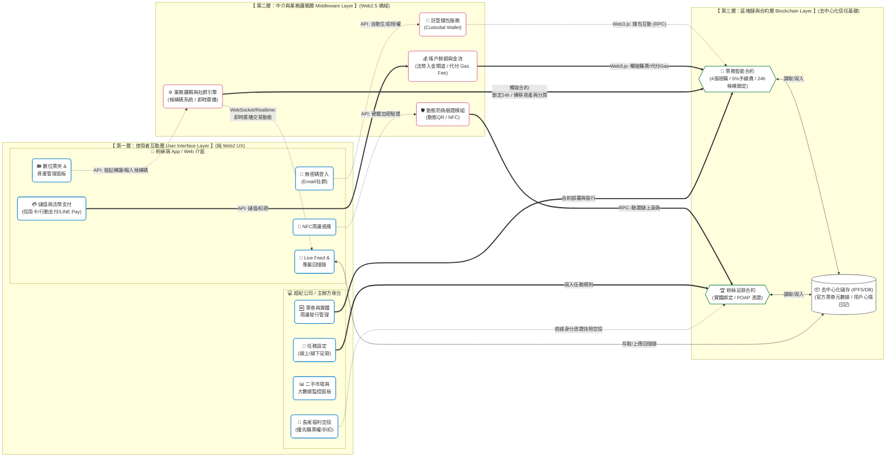

```mermaid
flowchart LR
    %% 定義顏色與樣式 (安全色碼與圓角)
    classDef uiNode fill:#ffffff,stroke:#007acc,stroke-width:2px,color:#333333,rx:8,ry:8
    classDef midNode fill:#ffffff,stroke:#db7093,stroke-width:2px,color:#333333,rx:8,ry:8
    classDef blockNode fill:#ffffff,stroke:#2e8b57,stroke-width:2px,color:#333333,rx:8,ry:8
    classDef storageNode fill:#ffffff,stroke:#888888,stroke-width:2px,color:#333333,rx:8,ry:8

    %% 第一層：使用者互動層
    subgraph Layer1 ["【 第一層：使用者互動層 User Interface Layer 】(純 Web2 UX)"]
        direction TB
        
        subgraph FanEnd ["📱 粉絲端 App / Web 介面"]
            direction TB
            F1("👤 無密碼登入\n(Email/社群)"):::uiNode
            F2("💳 儲值與法幣支付\n(信用卡/行動支付/LINE Pay)"):::uiNode
            F3("🎟️ 數位票夾 &\n資產管理面板"):::uiNode
            F5("💬 Live Feed &\n專屬回憶錄"):::uiNode
            F4("📡 NFC周邊感應"):::uiNode
        end

        subgraph AdminEnd ["💻 經紀公司 / 主辦方後台"]
            direction TB
            A1("🆕 票券與實體\n周邊發行管理"):::uiNode
            A2("🎯 任務設定\n(線上/線下足跡)"):::uiNode
            A3("📊 二手市場與\n大數據監控面板"):::uiNode
            A4("🎁 長尾福利空投\n(優先購票權/折扣)"):::uiNode
        end
    end

    %% 第二層：中介與業務邏輯層
    subgraph Layer2 ["【 第二層：中介與業務邏輯層 Middleware Layer 】(Web2.5 橋樑)"]
        direction TB
        M1("🔐 託管錢包服務\n(Custodial Wallet)"):::midNode
        M2("💰 帳戶餘額與金流\n(法幣入金閘道 / 代付 Gas Fee)"):::midNode
        M3("⚙️ 業務邏輯與社群引擎\n(候補碼系統 / 即時廣播)"):::midNode
        M4("🛡️ 動態防偽驗證模組\n(動態QR / NFC)"):::midNode
    end

    %% 第三層：區塊鏈與合約層
    subgraph Layer3 ["【 第三層：區塊鏈與合約層 Blockchain Layer 】(去中心化信任基礎)"]
        direction TB
        SC1{{"📝 票務智能合約\n(4張限購 / 5%手續費 / 24h候補鎖定)"}}:::blockNode
        SC2{{"🏆 粉絲足跡合約\n(實體綁定 / POAP 憑證)"}}:::blockNode
        IPFS[("📦 去中心化儲存 (IPFS/DB)\n(官方票券元數據 / 用戶心情日記)")]:::storageNode
    end

    %% 互動關係線
    
    F1 -.-> |"API: 自動生成/授權"| M1
    F2 ====> |"API: 儲值/扣款"| M2
    F3 -.-> |"API: 發起轉讓/輸入候補碼"| M3
    F4 -.-> |"API: 硬體加密驗證"| M4
    
    %% Live Feed 與引擎的雙向互動
    M3 -.-> |"WebSocket/Realtime:\n即時廣播交易動態"| F5

    %% 中介層對接區塊鏈
    M1 -.-> |"Web3.js: 錢包互動 (RPC)"| SC1
    M2 ====> |"Web3.js: 觸發購票/代付Gas"| SC1
    M3 ====> |"觸發合約:\n鎖定24h / 轉移資產與分潤"| SC1
    M4 ====> |"RPC: 驗證鏈上真偽"| SC2

    %% 後台操作
    A1 ====> |"合約部署與發行"| SC1
    A2 ====> |"寫入任務規則"| SC2
    A4 -.-> |"依據身分憑證快照空投"| SC2

    %% 儲存層互動
    SC1 <--> |"讀取/寫入"| IPFS
    SC2 <--> |"讀取/寫入"| IPFS
    F5 <--> |"存取/上傳回憶錄"| IPFS
```
