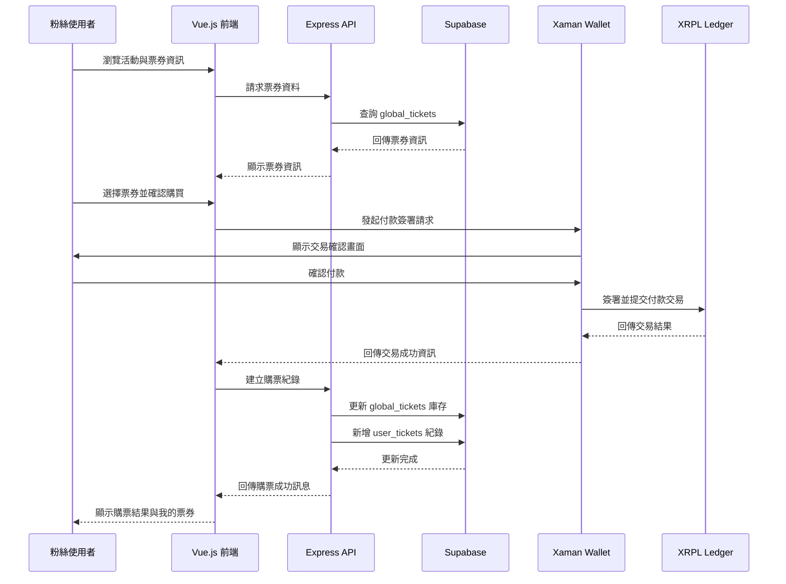
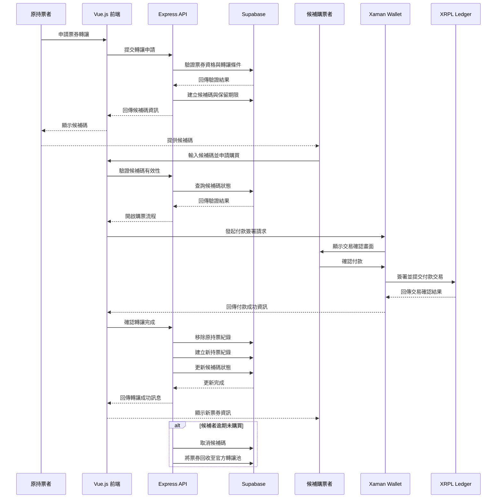

```mermaid
sequenceDiagram
    participant User as 粉絲使用者
    participant Frontend as Vue.js 前端
    participant Backend as Express API
    participant DB as Supabase
    participant Wallet as Xaman Wallet
    participant XRPL as XRPL Ledger

    User->>Frontend: 瀏覽活動與票券資訊
    Frontend->>Backend: 請求票券資料
    Backend->>DB: 查詢 global_tickets
    DB-->>Backend: 回傳票券資訊
    Backend-->>Frontend: 顯示票券資訊

    User->>Frontend: 選擇票券並確認購買
    Frontend->>Wallet: 發起付款簽署請求
    Wallet->>User: 顯示交易確認畫面
    User->>Wallet: 確認付款

    Wallet->>XRPL: 簽署並提交付款交易
    XRPL-->>Wallet: 回傳交易結果

    Wallet-->>Frontend: 回傳交易成功資訊
    Frontend->>Backend: 建立購票紀錄

    Backend->>DB: 更新 global_tickets 庫存
    Backend->>DB: 新增 user_tickets 紀錄

    DB-->>Backend: 更新完成
    Backend-->>Frontend: 回傳購票成功訊息

    Frontend-->>User: 顯示購票結果與我的票券
```

---

```mermaid
sequenceDiagram
    participant Seller as 原持票者
    participant Frontend as Vue.js 前端
    participant Backend as Express API
    participant DB as Supabase
    participant Buyer as 候補購票者
    participant Wallet as Xaman Wallet
    participant XRPL as XRPL Ledger

    Seller->>Frontend: 申請票券轉讓
    Frontend->>Backend: 提交轉讓申請
    Backend->>DB: 驗證票券資格與轉讓條件
    DB-->>Backend: 回傳驗證結果

    Backend->>DB: 建立候補碼與保留期限
    Backend-->>Frontend: 回傳候補碼資訊
    Frontend-->>Seller: 顯示候補碼

    Seller-->>Buyer: 提供候補碼

    Buyer->>Frontend: 輸入候補碼並申請購買
    Frontend->>Backend: 驗證候補碼有效性
    Backend->>DB: 查詢候補碼狀態
    DB-->>Backend: 回傳驗證結果
    Backend-->>Frontend: 開啟購票流程

    Frontend->>Wallet: 發起付款簽署請求
    Wallet->>Buyer: 顯示交易確認畫面
    Buyer->>Wallet: 確認付款

    Wallet->>XRPL: 簽署並提交付款交易
    XRPL-->>Wallet: 回傳交易確認結果
    Wallet-->>Frontend: 回傳付款成功資訊

    Frontend->>Backend: 確認轉讓完成
    Backend->>DB: 移除原持票紀錄
    Backend->>DB: 建立新持票紀錄
    Backend->>DB: 更新候補碼狀態

    DB-->>Backend: 更新完成
    Backend-->>Frontend: 回傳轉讓成功訊息
    Frontend-->>Buyer: 顯示新票券資訊

    alt 候補者逾期未購買
        Backend->>DB: 取消候補碼
        Backend->>DB: 將票券回收至官方轉讓池
    end
```
