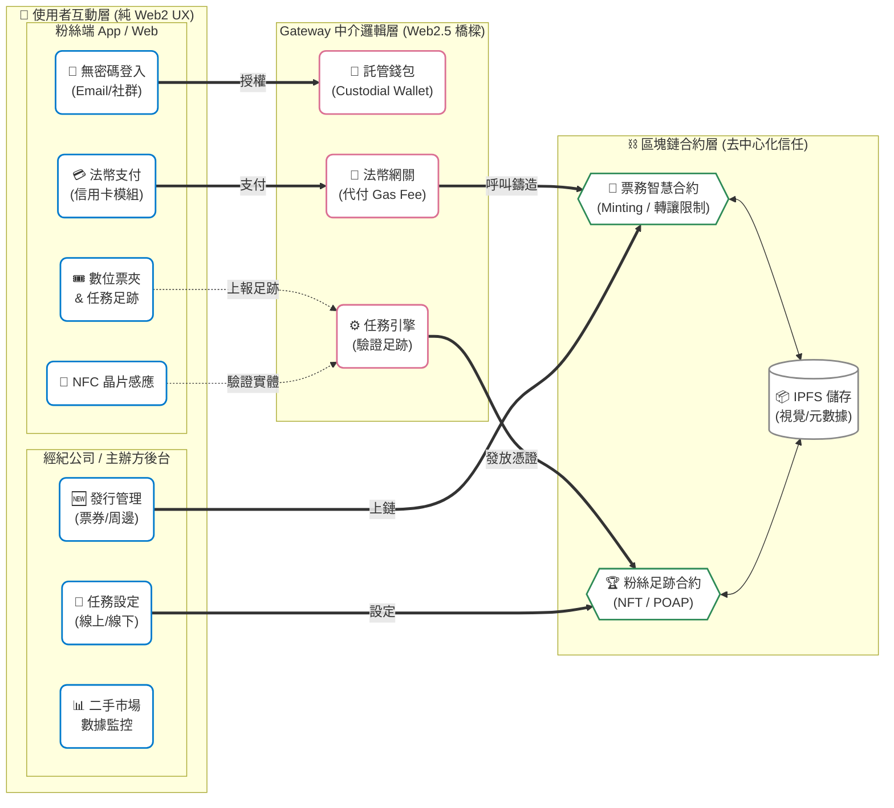

## 系統架構圖

```mermaid
flowchart LR
    %% 定義顏色與樣式 (使用最安全的 6 碼色碼，移除 padding 避免特定版本不支援)
    classDef uiNode fill:#ffffff,stroke:#007acc,stroke-width:2px,color:#333333,rx:8,ry:8
    classDef midNode fill:#ffffff,stroke:#db7093,stroke-width:2px,color:#333333,rx:8,ry:8
    classDef blockNode fill:#ffffff,stroke:#2e8b57,stroke-width:2px,color:#333333,rx:8,ry:8
    classDef storageNode fill:#ffffff,stroke:#888888,stroke-width:2px,color:#333333

    %% 第一層：使用者互動層 UI
    subgraph Layer1 ["📱 使用者互動層 (純 Web2 UX)"]
        direction TB
        
        subgraph FanEnd ["粉絲端 App / Web"]
            direction TB
            F1("👤 無密碼登入\n(Email/社群)"):::uiNode
            F2("💳 法幣支付\n(信用卡模組)"):::uiNode
            F3("🎟️ 數位票夾\n& 任務足跡"):::uiNode
            F4("📡 NFC 晶片感應"):::uiNode
        end

        subgraph AdminEnd ["經紀公司 / 主辦方後台"]
            direction TB
            A1("🆕 發行管理\n(票券/周邊)"):::uiNode
            A2("🎯 任務設定\n(線上/線下)"):::uiNode
            A3("📊 二手市場\n數據監控"):::uiNode
        end
    end

    %% 第二層：中介與業務邏輯層 Backend
    subgraph Layer2 ["Gateway 中介邏輯層 (Web2.5 橋樑)"]
        direction TB
        M1("🔐 託管錢包\n(Custodial Wallet)"):::midNode
        M2("💸 法幣網關\n(代付 Gas Fee)"):::midNode
        M3("⚙️ 任務引擎\n(驗證足跡)"):::midNode
    end

    %% 第三層：區塊鏈與合約層 Blockchain
    subgraph Layer3 ["⛓️ 區塊鏈合約層 (去中心化信任)"]
        direction TB
        SC1{{"📜 票務智慧合約\n(Minting / 轉讓限制)"}}:::blockNode
        SC2{{"🏆 粉絲足跡合約\n(NFT / POAP)"}}:::blockNode
        IPFS[("📦 IPFS 儲存\n(視覺/元數據)")]:::storageNode
    end

    %% 互動關係線 (使用原生箭頭，避免報錯)
    F1 ==> |授權| M1
    F2 ==> |支付| M2
    M2 ==> |呼叫鑄造| SC1
    F3 -.-> |上報足跡| M3
    F4 -.-> |驗證實體| M3
    M3 ==> |發放憑證| SC2
    A1 ===> |上鏈| SC1
    A2 ===> |設定| SC2
    SC1 <--> IPFS
    SC2 <--> IPFS
```
