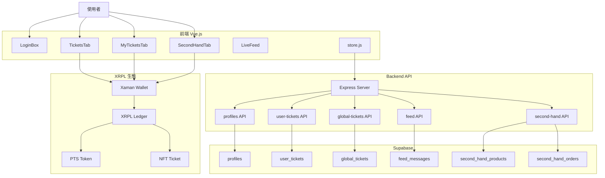
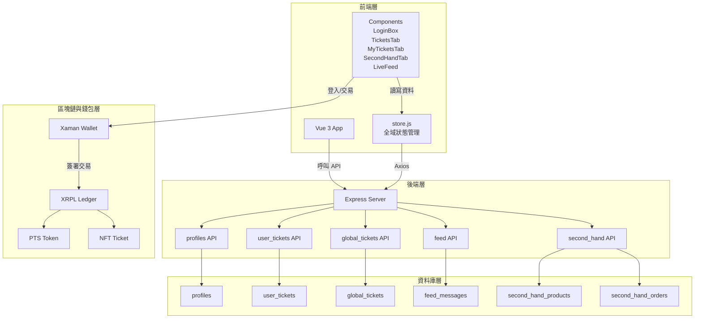

```mermaid
graph TD

U[使用者]

subgraph Frontend[前端 Vue.js]
A1[LoginBox]
A2[TicketsTab]
A3[MyTicketsTab]
A4[SecondHandTab]
A5[LiveFeed]
A6[store.js]
end

subgraph Backend[Backend API]
B1[Express Server]
B2[profiles API]
B3[user-tickets API]
B4[global-tickets API]
B5[feed API]
B6[second-hand API]
end

subgraph Database[Supabase]
C1[profiles]
C2[user_tickets]
C3[global_tickets]
C4[feed_messages]
C5[second_hand_products]
C6[second_hand_orders]
end

subgraph XRPL[XRPL 生態]
D1[Xaman Wallet]
D2[XRPL Ledger]
D3[PTS Token]
D4[NFT Ticket]
end

U --> A1
U --> A2
U --> A3
U --> A4

A6 --> B1

B1 --> B2
B1 --> B3
B1 --> B4
B1 --> B5
B1 --> B6

B2 --> C1
B3 --> C2
B4 --> C3
B5 --> C4
B6 --> C5
B6 --> C6

A2 --> D1
A3 --> D1
A4 --> D1

D1 --> D2
D2 --> D3
D2 --> D4
```

---

```mermaid
flowchart TB

subgraph Frontend[前端層]
    A1[Vue 3 App]
    A2[Components<br/>LoginBox<br/>TicketsTab<br/>MyTicketsTab<br/>SecondHandTab<br/>LiveFeed]
    A3[store.js<br/>全域狀態管理]
    
    A2 -->|讀寫資料| A3
end

subgraph Backend[後端層]
    B1[Express Server]
    B2[profiles API]
    B3[user_tickets API]
    B4[global_tickets API]
    B5[feed API]
    B6[second_hand API]
end

subgraph Database[資料庫層]
    C1[profiles]
    C2[user_tickets]
    C3[global_tickets]
    C4[feed_messages]
    C5[second_hand_products]
    C6[second_hand_orders]
end

subgraph Blockchain[區塊鏈與錢包層]
    D1[Xaman Wallet]
    D2[XRPL Ledger]
    D3[PTS Token]
    D4[NFT Ticket]
end

A1 -->|呼叫 API| B1

A3 -->|Axios| B1

B1 --> B2
B1 --> B3
B1 --> B4
B1 --> B5
B1 --> B6

B2 --> C1
B3 --> C2
B4 --> C3
B5 --> C4
B6 --> C5
B6 --> C6

A2 -->|登入/交易| D1
D1 -->|簽署交易| D2

D2 --> D3
D2 --> D4
```
