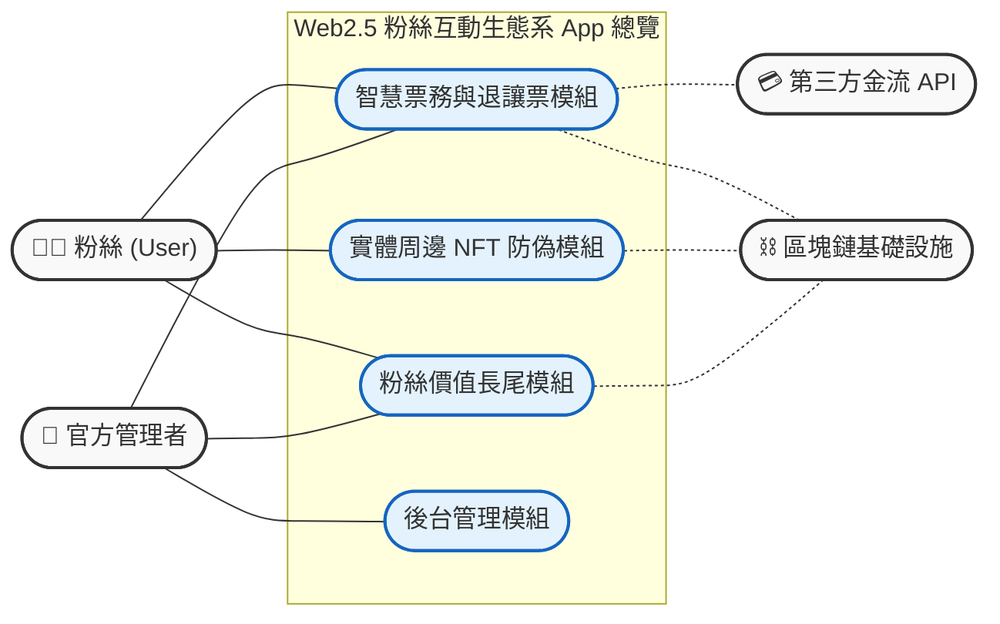
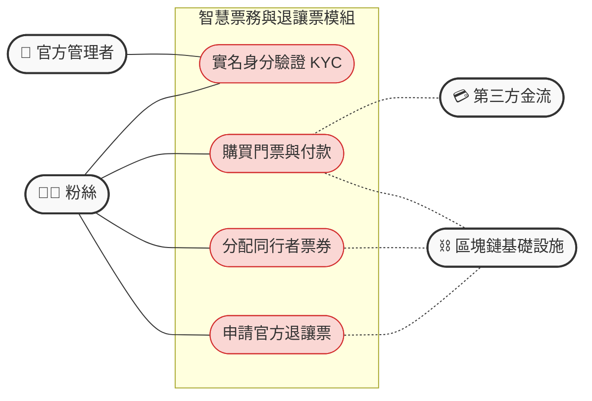
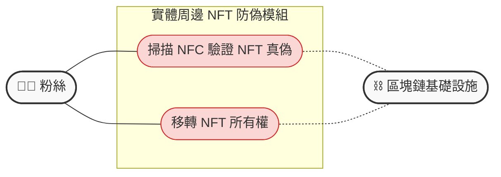
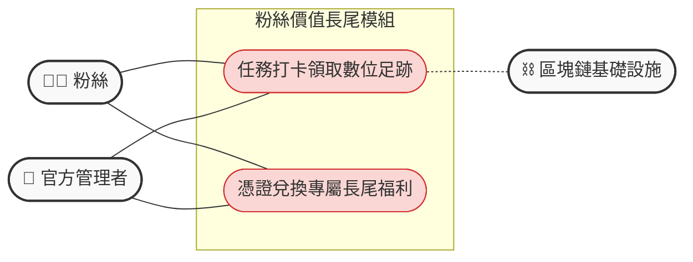
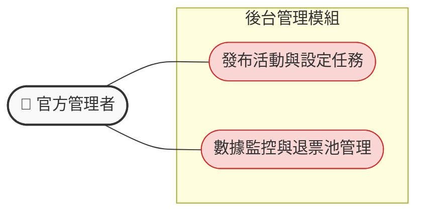

## 高階總覽圖

---

### A. 智慧票務與退讓票模組
這裡展示了粉絲與金流、區塊鏈的清晰互動，管理者僅介入 KYC 審核。

---

### B. 實體周邊 NFT 防偽模組
極度單純的驗證與轉移流程。

---

### C. 粉絲價值長尾模組
明確區分出「官方設定規則」與「粉絲執行任務」的雙向互動。

---

### D. 後台管理模組
專屬於官方管理者的獨立作業區塊。

