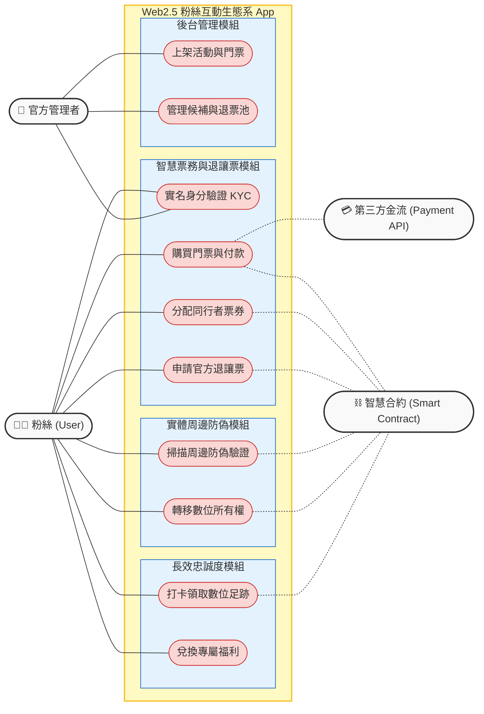

## Use Case Diagram

```mermaid
flowchart LR
    %% 定義左側主動參與者
    Fan(["🧑‍🎤 粉絲 (User)"])
    Admin(["🏢 官方管理者"])

    %% 定義系統邊界與模組 (移除 direction TB 讓畫面更容易向兩側展開)
    subgraph SystemBoundary [Web2.5 粉絲互動生態系 App]
        
        subgraph TicketSystem [智慧票務與退讓票模組]
            UC1([實名身分驗證 KYC])
            UC2([購買門票與付款])
            UC3([分配同行者票券])
            UC4([申請官方退讓票])
        end

        subgraph MerchSystem [實體周邊防偽模組]
            UC5([掃描周邊防偽驗證])
            UC6([轉移數位所有權])
        end

        subgraph LoyaltySystem [長效忠誠度模組]
            UC7([打卡領取數位足跡])
            UC8([兌換專屬福利])
        end

        subgraph AdminSystem [後台管理模組]
            UC9([上架活動與門票])
            UC10([管理候補與退票池])
        end
    end

    %% 定義右側外部依賴系統
    SC(["⛓️ 智慧合約 (Smart Contract)"])
    Pay(["💳 第三方金流 (Payment API)"])

    %% 左側粉絲主動互動連線 (實線)
    Fan --- UC1
    Fan --- UC2
    Fan --- UC3
    Fan --- UC4
    Fan --- UC5
    Fan --- UC6
    Fan --- UC7
    Fan --- UC8

    %% 左側官方管理者互動連線 (實線)
    Admin --- UC1
    Admin --- UC9
    Admin --- UC10

    %% 右側外部系統被動呼叫連線 (虛線，代表系統依賴)
    UC2 -.- Pay
    UC2 -.- SC
    UC3 -.- SC
    UC4 -.- SC
    UC5 -.- SC
    UC6 -.- SC
    UC7 -.- SC

    %% 樣式與排版設定
    classDef actor fill:#f9f9f9,stroke:#333,stroke-width:2px;
    classDef usecase fill:#fad7d4,stroke:#d32f2f,stroke-width:1px;
    classDef package fill:#e3f2fd,stroke:#1565c0,stroke-width:1px;
    classDef boundary fill:#fff9c4,stroke:#fbc02d,stroke-width:2px;

    class Fan,Admin,SC,Pay actor;
    class UC1,UC2,UC3,UC4,UC5,UC6,UC7,UC8,UC9,UC10 usecase;
    class TicketSystem,MerchSystem,LoyaltySystem,AdminSystem package;
    class SystemBoundary boundary;
```
---
## 循環圖
