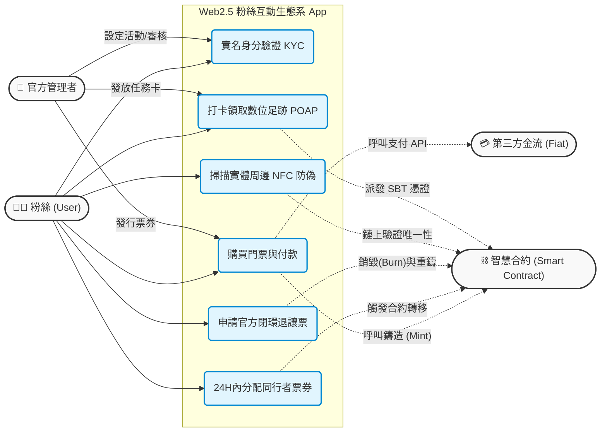

## Use Case Diagram

```mermaid
flowchart LR
    %% 定義參與者
    Fan(["🧑‍🎤 粉絲 (User)"])
    Admin(["🏢 官方管理者"])
    SC(["⛓️ 智慧合約 (Smart Contract)"])
    Pay(["💳 第三方金流 (Fiat)"])

    %% 定義系統邊界與案例
    subgraph SystemBoundary [Web2.5 粉絲互動生態系 App]
        direction TB
        UC1(實名身分驗證 KYC)
        UC2(購買門票與付款)
        UC3(24H內分配同行者票券)
        UC4(申請官方閉環退讓票)
        UC5(掃描實體周邊 NFC 防偽)
        UC6(打卡領取數位足跡 POAP)
    end

    %% 粉絲互動線
    Fan --> UC1
    Fan --> UC2
    Fan --> UC3
    Fan --> UC4
    Fan --> UC5
    Fan --> UC6

    %% 管理者互動線
    Admin -->|設定活動/審核| UC1
    Admin -->|發行票券| UC2
    Admin -->|發放任務卡| UC6

    %% 系統與外部/區塊鏈互動線
    UC2 -. "呼叫支付 API" .-> Pay
    UC2 -. "呼叫鑄造 (Mint)" .-> SC
    UC3 -. "觸發合約轉移" .-> SC
    UC4 -. "銷毀(Burn)與重鑄" .-> SC
    UC5 -. "鏈上驗證唯一性" .-> SC
    UC6 -. "派發 SBT 憑證" .-> SC

    %% 樣式設定
    classDef actor fill:#f9f9f9,stroke:#333,stroke-width:2px;
    classDef usecase fill:#e1f5fe,stroke:#0288d1,stroke-width:2px;
    class Fan,Admin,SC,Pay actor;
    class UC1,UC2,UC3,UC4,UC5,UC6 usecase;
```
---
## 循環圖
