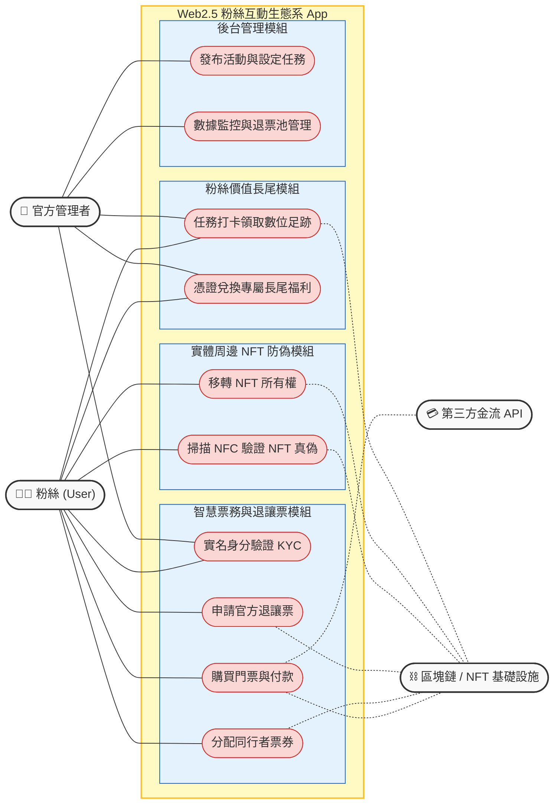

## Use Case Diagram
掃描周邊防偽驗證應該是NFT不是智能合約的工作  
打卡領取數位足跡是任務卡領取福利，跟智能合約也無關

```mermaid
flowchart LR
    %% 定義左側主動參與者
    Fan(["🧑‍🎤 粉絲 (User)"])
    Admin(["🏢 官方管理者"])

    %% 系統邊界與模組
    subgraph SystemBoundary [Web2.5 粉絲互動生態系 App]
        direction LR
        
        subgraph TicketSystem [智慧票務與退讓票模組]
            UC1([實名身分驗證 KYC])
            UC2([購買門票與付款])
            UC3([分配同行者票券])
            UC4([申請官方退讓票])
        end

        subgraph MerchSystem [實體周邊 NFT 防偽模組]
            UC5([掃描 NFC 驗證 NFT 真偽])
            UC6([移轉 NFT 所有權])
        end

        subgraph LongTailSystem [粉絲價值長尾模組]
            UC7([任務打卡領取數位足跡])
            UC8([憑證兌換專屬長尾福利])
        end

        subgraph AdminSystem [後台管理模組]
            UC9([發布活動與設定任務])
            UC10([數據監控與退票池管理])
        end
    end

    %% 定義右側外部依賴
    Blockchain(["⛓️ 區塊鏈 / NFT 基礎設施"])
    Pay(["💳 第三方金流 API"])

    %% --- 連線關係 ---

    %% 粉絲互動 (實線)
    Fan --- UC1
    Fan --- UC2
    Fan --- UC3
    Fan --- UC4
    Fan --- UC5
    Fan --- UC6
    Fan --- UC7
    Fan --- UC8

    %% 管理者互動 (實線)
    Admin --- UC1
    Admin --- UC9
    Admin --- UC10
    %% 官方設定任務
    Admin --- UC7 
    %% 官方管理福利發放
    Admin --- UC8 

    %% 系統自動化呼叫 (虛線)
    UC2 -.- Pay
    UC2 -.- Blockchain
    UC3 -.- Blockchain
    UC4 -.- Blockchain
    %% 驗證 NFT
    UC5 -.- Blockchain 
    %% 轉移資產
    UC6 -.- Blockchain 
    %% 派發 POAP/SBT 數位足跡
    UC7 -.- Blockchain 

    %% 樣式設定
    classDef actor fill:#f9f9f9,stroke:#333,stroke-width:2px;
    classDef usecase fill:#fad7d4,stroke:#d32f2f,stroke-width:1px;
    classDef package fill:#e3f2fd,stroke:#1565c0,stroke-width:1px;
    classDef boundary fill:#fff9c4,stroke:#fbc02d,stroke-width:2px;

    class Fan,Admin,Blockchain,Pay actor;
    class UC1,UC2,UC3,UC4,UC5,UC6,UC7,UC8,UC9,UC10 usecase;
    class TicketSystem,MerchSystem,LongTailSystem,AdminSystem package;
    class SystemBoundary boundary;
```
---
## 循環圖
