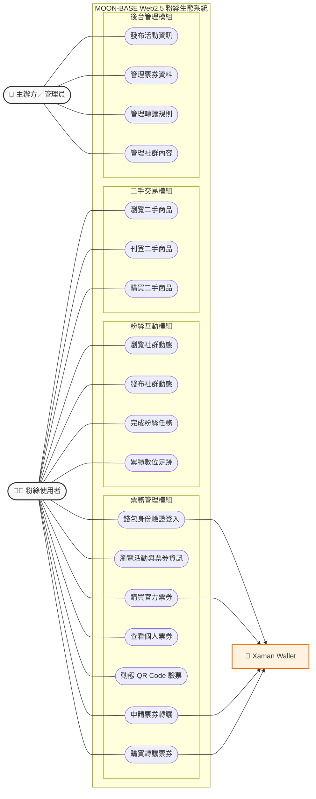
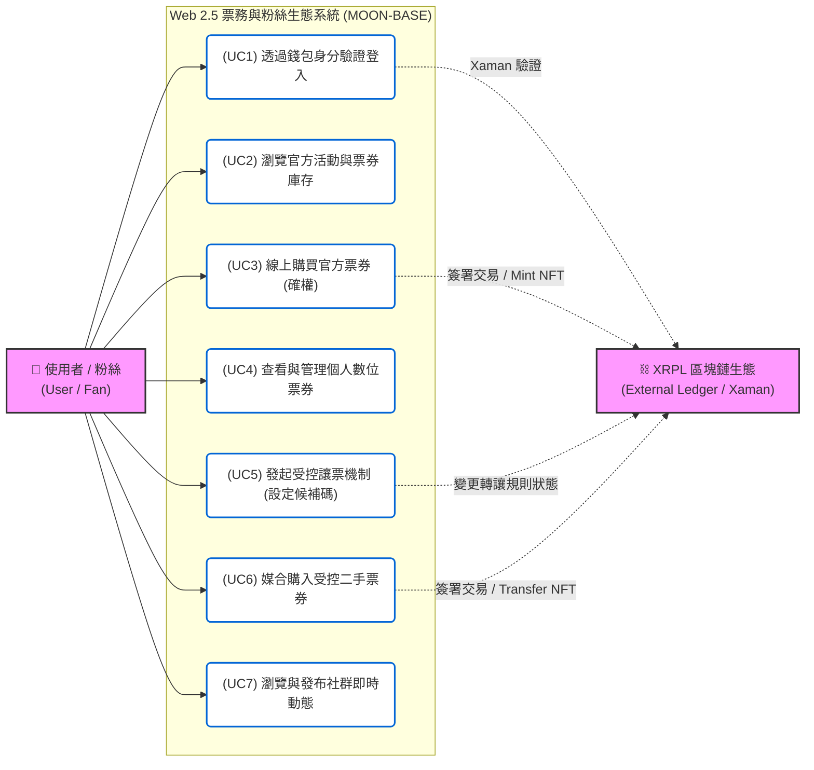

## Use Case Diagram

```mermaid
flowchart LR

User(["🧑‍💻 粉絲使用者"])
Admin(["🏢 主辦方／管理員"])

Wallet["👛 Xaman Wallet"]

subgraph SystemBoundary ["MOON-BASE Web2.5 粉絲生態系統"]

direction TB

subgraph TicketModule ["票務管理模組"]
UC1([錢包身份驗證登入])
UC2([瀏覽活動與票券資訊])
UC3([購買官方票券])
UC4([查看個人票券])
UC5([動態 QR Code 驗票])
UC6([申請票券轉讓])
UC7([購買轉讓票券])
end

subgraph CommunityModule ["粉絲互動模組"]
UC8([瀏覽社群動態])
UC9([發布社群動態])
UC10([完成粉絲任務])
UC11([累積數位足跡])
end

subgraph SecondHandModule ["二手交易模組"]
UC12([瀏覽二手商品])
UC13([刊登二手商品])
UC14([購買二手商品])
end

subgraph AdminModule ["後台管理模組"]
UC15([發布活動資訊])
UC16([管理票券資料])
UC17([管理轉讓規則])
UC18([管理社群內容])
end

end

User --- UC1
User --- UC2
User --- UC3
User --- UC4
User --- UC5
User --- UC6
User --- UC7
User --- UC8
User --- UC9
User --- UC10
User --- UC11
User --- UC12
User --- UC13
User --- UC14

Admin --- UC15
Admin --- UC16
Admin --- UC17
Admin --- UC18

UC1 --> Wallet
UC3 --> Wallet
UC6 --> Wallet
UC7 --> Wallet

classDef actor fill:#f9f9f9,stroke:#333,stroke-width:2px;
classDef system fill:#e3f2fd,stroke:#1565c0,stroke-width:1px;
classDef external fill:#fff3e0,stroke:#ef6c00,stroke-width:2px;

class User,Admin actor;
class Wallet external;
```
---

```mermaid
graph LR
    %% 節點樣式定義
    classDef actor fill:#f9f,stroke:#333,stroke-width:2px;
    classDef usecase fill:#fff,stroke:#0366d6,stroke-width:2px,shape:oval;
    classDef boundary fill:#f6f8fa,stroke:#e1e4e6,stroke-width:2px,stroke-dasharray: 5 5;

    %% 角色定義 (Actors)
    User["👤 使用者 / 粉絲<br>(User / Fan)"]:::actor
    XRPL["⛓️ XRPL 區塊鏈生態<br>(External Ledger / Xaman)"]:::actor

    %% 系統邊界與使用案例 (System Boundary & Use Cases)
    subgraph SystemBoundary["Web 2.5 票務與粉絲生態系統 (MOON-BASE)"]
        %% 登入模組
        UC1("(UC1) 透過錢包身分驗證登入"):::usecase
        
        %% 票券瀏覽與購買模組
        UC2("(UC2) 瀏覽官方活動與票券庫存"):::usecase
        UC3("(UC3) 線上購買官方票券 (確權)"):::usecase
        
        %% 個人票券管理模組
        UC4("(UC4) 查看與管理個人數位票券"):::usecase
        
        %% 受控二手交易模組
        UC5("(UC5) 發起受控讓票機制 (設定候補碼)"):::usecase
        UC6("(UC6) 媒合購入受控二手票券"):::usecase
        
        %% 即時動態社群模組
        UC7("(UC7) 瀏覽與發布社群即時動態"):::usecase
    end

    %% 使用者與使用案例的關聯 (Associations)
    User --> UC1
    User --> UC2
    User --> UC3
    User --> UC4
    User --> UC5
    User --> UC6
    User --> UC7

    %% 使用案例與外部區塊鏈生態的互動關聯
    UC1 -.->|Xaman 驗證| XRPL
    UC3 -.->|簽署交易 / Mint NFT| XRPL
    UC5 -.->|變更轉讓規則狀態| XRPL
    UC6 -.->|簽署交易 / Transfer NFT| XRPL

    %% 調整圖表層次結構
    style SystemBoundary boundary
```
---
## 循環圖
