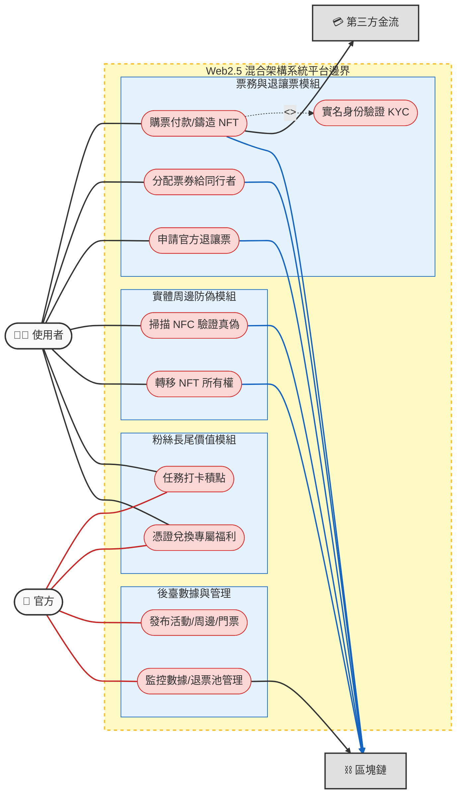
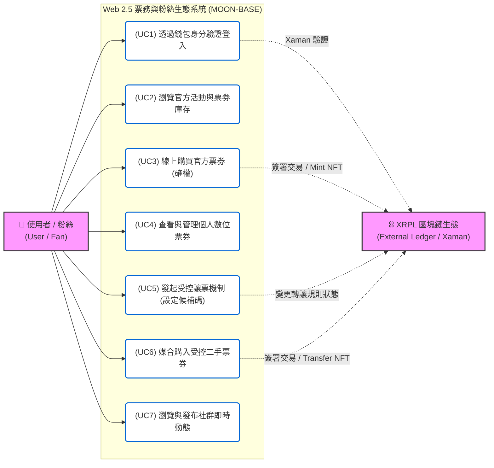

## Use Case Diagram

```mermaid
flowchart LR
    %% ==== 1. 定義參與者與外部系統 ====
    User(["🧑‍💻 使用者"])
    Admin(["🏢 官方"])
    
    %% 外部系統改用方塊表示 (符合 UML 規範)
    Pay["💳 第三方金流"]
    Blockchain["⛓️ 區塊鏈"]

    %% ==== 2. 定義系統邊界與內部模組 ====
    subgraph SystemBoundary ["Web2.5 混合架構系統平台邊界"]
        direction TB
        
        subgraph TicketModule ["票務與退讓票模組"]
            UC1([實名身份驗證 KYC])
            UC2([購票付款/鑄造 NFT])
            UC3([分配票券給同行者])
            UC4([申請官方退讓票])
        end
        
        subgraph MerchModule ["實體周邊防偽模組"]
            UC5([掃描 NFC 驗證真偽])
            UC6([轉移 NFT 所有權])
        end
        
        subgraph LongTailModule ["粉絲長尾價值模組"]
            UC7([任務打卡積點])
            UC8([憑證兌換專屬福利])
        end
        
        subgraph AdminModule ["後臺數據與管理"]
            UC9([發布活動/周邊/門票])
            UC10([監控數據/退票池管理])
        end
    end

    %% ==== 3. 定義連線邏輯 ====

    %% Include 關係 (Index 0)
    UC2 -.->|"<<Include>>"| UC1

    %% 使用者連線 (Index 1~7)
    User --- UC2
    User --- UC3
    User --- UC4
    User --- UC5
    User --- UC6
    User --- UC7
    User --- UC8

    %% 官方連線 (Index 8~11)
    Admin --- UC7
    Admin --- UC8
    Admin --- UC9
    Admin --- UC10

    %% 外部系統連線：第三方金流 (Index 12)
    UC2 --> Pay

    %% 外部系統連線：區塊鏈 (Index 13~17)
    UC2 --> Blockchain
    UC3 --> Blockchain
    UC4 --> Blockchain
    UC5 --> Blockchain
    UC6 --> Blockchain

    %% 外部系統連線：後臺監控 (Index 18)
    UC10 --> Blockchain

    %% ==== 4. 設定線條顏色與樣式 ====
    %% 官方紅線
    linkStyle 8,9,10,11 stroke:#c62828,stroke-width:2px;
    %% 區塊鏈藍線
    linkStyle 13,14,15,16,17 stroke:#1565c0,stroke-width:2px;
    %% 預設黑線 (使用者、金流、後臺)
    linkStyle 1,2,3,4,5,6,7,12,18 stroke:#333333,stroke-width:2px;

    %% ==== 5. 設定節點與區塊顏色 ====
    classDef actor fill:#f9f9f9,stroke:#333,stroke-width:2px;
    classDef system fill:#e0e0e0,stroke:#333,stroke-width:2px;
    classDef usecase fill:#fad7d4,stroke:#d32f2f,stroke-width:1px;
    classDef boundary fill:#fff9c4,stroke:#fbc02d,stroke-width:2px,stroke-dasharray: 5 5;
    classDef module fill:#e3f2fd,stroke:#1565c0,stroke-width:1px;

    class User,Admin actor;
    class Pay,Blockchain system;
    class UC1,UC2,UC3,UC4,UC5,UC6,UC7,UC8,UC9,UC10 usecase;
    class SystemBoundary boundary;
    class TicketModule,MerchModule,LongTailModule,AdminModule module;
```
---

```mermaid
graph LR
    %% 節點樣式定義
    classDef actor fill:#f9f,stroke:#333,stroke-width:2px;
    classDef usecase fill:#fff,stroke:#0366d6,stroke-width:2px,shape:oval;
    classDef boundary fill:#f6f8fa,stroke:#e1e4e6,stroke-width:2px,stroke-dasharray: 5 5;

    %% 角色定義 (Actors)
    User["👤 使用者 / 粉絲<br>(User / Fan)"]:::actor
    XRPL["⛓️ XRPL 區塊鏈生態<br>(External Ledger / Xaman)"]:::actor

    %% 系統邊界與使用案例 (System Boundary & Use Cases)
    subgraph SystemBoundary["Web 2.5 票務與粉絲生態系統 (MOON-BASE)"]
        %% 登入模組
        UC1("(UC1) 透過錢包身分驗證登入"):::usecase
        
        %% 票券瀏覽與購買模組
        UC2("(UC2) 瀏覽官方活動與票券庫存"):::usecase
        UC3("(UC3) 線上購買官方票券 (確權)"):::usecase
        
        %% 個人票券管理模組
        UC4("(UC4) 查看與管理個人數位票券"):::usecase
        
        %% 受控二手交易模組
        UC5("(UC5) 發起受控讓票機制 (設定候補碼)"):::usecase
        UC6("(UC6) 媒合購入受控二手票券"):::usecase
        
        %% 即時動態社群模組
        UC7("(UC7) 瀏覽與發布社群即時動態"):::usecase
    end

    %% 使用者與使用案例的關聯 (Associations)
    User --> UC1
    User --> UC2
    User --> UC3
    User --> UC4
    User --> UC5
    User --> UC6
    User --> UC7

    %% 使用案例與外部區塊鏈生態的互動關聯
    UC1 -.->|Xaman 驗證| XRPL
    UC3 -.->|簽署交易 / Mint NFT| XRPL
    UC5 -.->|變更轉讓規則狀態| XRPL
    UC6 -.->|簽署交易 / Transfer NFT| XRPL

    %% 調整圖表層次結構
    style SystemBoundary boundary
```
---
## 循環圖
