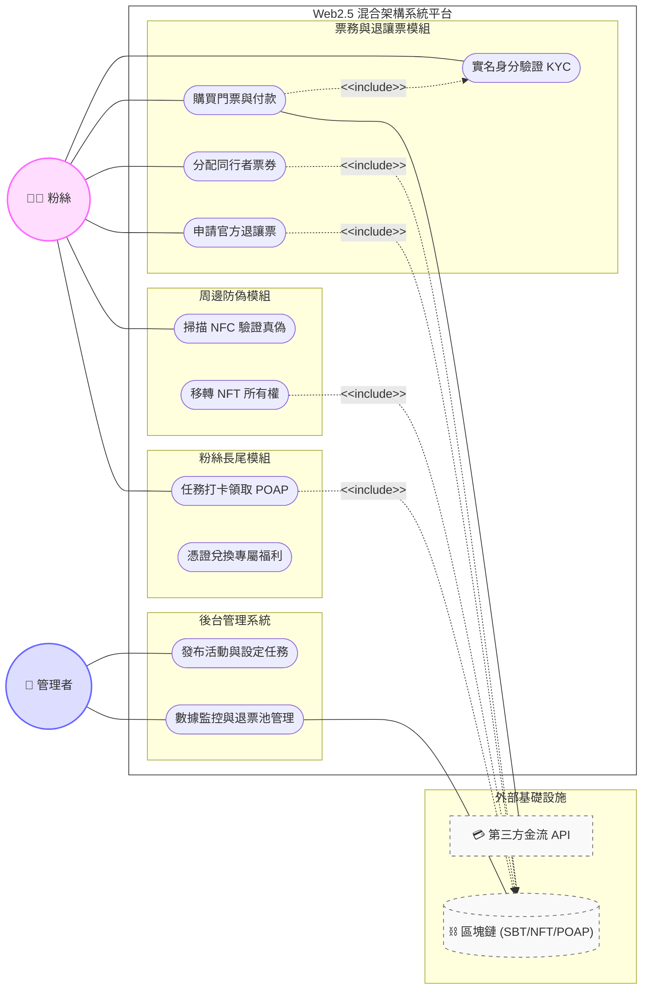
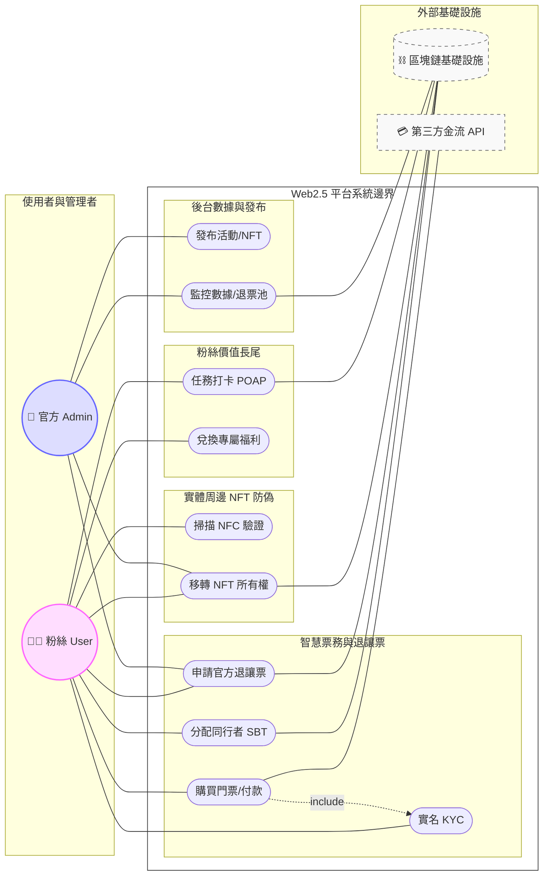

```mermaid
graph LR
    %% --- 參與者定義 (Actors) ---
    User(("&nbsp;&nbsp;&nbsp; 🧑‍🎤 粉絲 &nbsp;&nbsp;&nbsp;"))
    Admin(("&nbsp;&nbsp;&nbsp; 🏢 管理者 &nbsp;&nbsp;&nbsp;"))
    
    subgraph External_Systems [外部基礎設施]
        BC[("⛓️ 區塊鏈 (SBT/NFT/POAP)")]
        Pay["💳 第三方金流 API"]
    end

    %% --- 系統邊界 (System Boundary) ---
    subgraph Platform [Web2.5 混合架構系統平台]
        direction TB

        subgraph Module1 [票務與退讓票模組]
            UC1([實名身分驗證 KYC])
            UC2([購買門票與付款])
            UC3([分配同行者票券])
            UC4([申請官方退讓票])
        end

        subgraph Module2 [周邊防偽模組]
            UC5([掃描 NFC 驗證真偽])
            UC6([移轉 NFT 所有權])
        end

        subgraph Module3 [粉絲長尾模組]
            UC7([任務打卡領取 POAP])
            UC8([憑證兌換專屬福利])
        end

        subgraph Module4 [後台管理系統]
            UC9([發布活動與設定任務])
            UC10([數據監控與退票池管理])
        end
    end

    %% --- 關聯線 (Relationships) ---
    
    %% 粉絲操作
    User --- UC1
    User --- UC2
    User --- UC3
    User --- UC4
    User --- UC5
    User --- UC7
    
    %% 管理者操作
    Admin --- UC9
    Admin --- UC10

    %% 關鍵邏輯關係 (Include/Extend)
    UC2 -.->|&lt;&lt;include&gt;&gt;| UC1
    UC3 -.->|&lt;&lt;include&gt;&gt;| BC
    UC4 -.->|&lt;&lt;include&gt;&gt;| BC
    UC6 -.->|&lt;&lt;include&gt;&gt;| BC
    UC7 -.->|&lt;&lt;include&gt;&gt;| BC

    %% 外部系統連結
    UC2 --- Pay
    UC10 --- BC

    %% --- 樣式美化 (Styling) ---
    style User fill:#fdf,stroke:#f6f,stroke-width:2px
    style Admin fill:#ddf,stroke:#66f,stroke-width:2px
    style Platform fill:#fff,stroke:#333,stroke-width:1px
    style BC fill:#f9f9f9,stroke:#666,stroke-dasharray: 5 5
    style Pay fill:#f9f9f9,stroke:#666,stroke-dasharray: 5 5
```
---

```mermaid
graph LR
    %% --- 左側：參與者 (Actors) ---
    subgraph Left_Actors ["使用者與管理者"]
        direction TB
        User((🧑‍🎤 粉絲 User))
        Admin((🏢 官方 Admin))
    end

    %% --- 中間：平台核心功能 (System Boundary) ---
    subgraph Platform ["Web2.5 平台系統邊界"]
        direction TB
        
        subgraph Mod1 ["智慧票務與退讓票"]
            UC1([實名 KYC])
            UC2([購買門票/付款])
            UC3([分配同行者 SBT])
            UC4([申請官方退讓票])
        end

        subgraph Mod2 ["實體周邊 NFT 防偽"]
            UC5([掃描 NFC 驗證])
            UC6([移轉 NFT 所有權])
        end

        subgraph Mod3 ["粉絲價值長尾"]
            UC7([任務打卡 POAP])
            UC8([兌換專屬福利])
        end

        subgraph Mod4 ["後台數據與發布"]
            UC9([發布活動/NFT])
            UC10([監控數據/退票池])
        end
    end

    %% --- 右側：技術基礎設施 ---
    subgraph Infra ["外部基礎設施"]
        direction TB
        BC[("⛓️ 區塊鏈基礎設施")]
        Pay["💳 第三方金流 API"]
    end

    %% --- 關聯線定義 ---

    %% 粉絲連線
    User --- UC1
    User --- UC2
    User --- UC3
    User --- UC4
    User --- UC5
    User --- UC6
    User --- UC7
    User --- UC8

    %% 官方管理連線 (修正版：移除行尾註解避免報錯)
    Admin --- UC9
    Admin --- UC10
    Admin --- UC4
    Admin --- UC6

    %% 平台功能與外部系統連線
    UC2 --- Pay
    UC3 --- BC
    UC4 --- BC
    UC6 --- BC
    UC7 --- BC
    UC10 --- BC

    %% 內部包含關係
    UC2 -.->|include| UC1

    %% --- 樣式美化 ---
    style User fill:#fdf,stroke:#f6f,stroke-width:2px
    style Admin fill:#ddf,stroke:#66f,stroke-width:2px
    style Platform fill:#fff,stroke:#333,stroke-width:1px
    style BC fill:#f9f9f9,stroke:#666,stroke-dasharray: 5 5
    style Pay fill:#f9f9f9,stroke:#666,stroke-dasharray: 5 5
```
